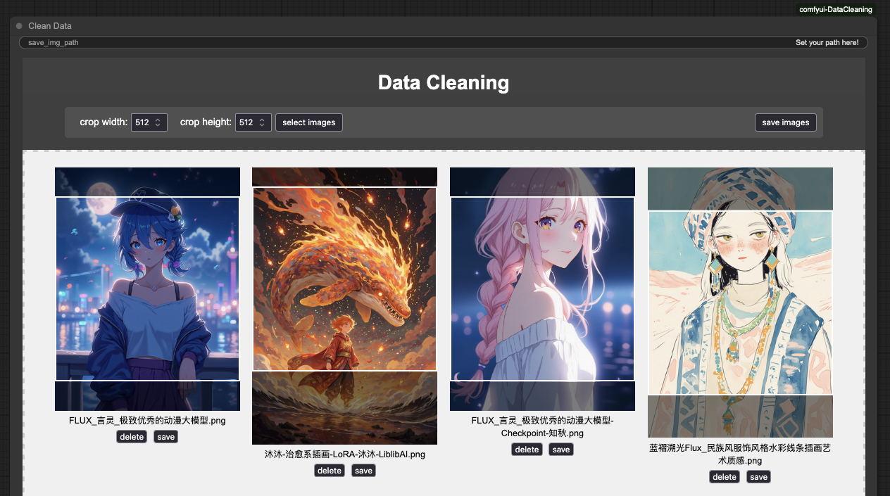

# comfyui-DataCleaning
🥰🥰🥰🥰
This custom node can be used in Image cropping and Image resizing!  It's easy to use and understand! Hope you like it! 

The original intention of this node is to ensure data security, expecially on your personal data.
(If you have some good advices, please contact me in the issues or email me in linsensen_1@163.com!)

# Example

### Note (It's better for you to read this Note before you use this node)
1. You can use the `select images` button to import your images or just drag your images into the node.
2. You can use mouse to move the crop window to select the image which you want to crop.
2. You can click the `delete` button which is under the image to delete the image.
3. You can click the `save` button which is under the image to save the image by the browser.
or use the `save images` button to save all the images and it's necessary for you to set your save path in the 'save_img_path'.

# Installation
1. Clone this reporitory into `custom_nodes` folder in your ComfyUI folder.
2. Install the dependencies: `pip install -r requirements.txt`. (It just need `Pillow`, so you can just install it with `pip install Pillow`)
3. you can either use `ComfyUI-Manager` to install it.

# To Do List
- [x] Basic interface and Basic function including crop and resize.
- [ ] Add the segmentation function to process the images in order to remove the background or obtain the subject which you want to use only.
